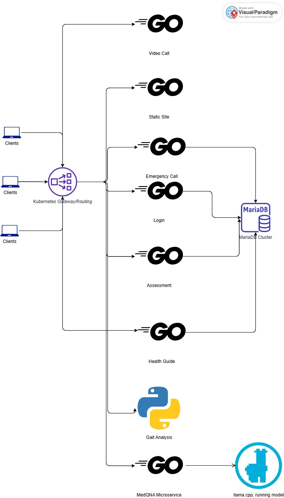

# SCDB-CNAD Assignment2
## Table of Contents
- About the Project
- Features
- Technologies Used
- Architecture
- Setup Instructions

### About the Project
SCDB aims to provide seniors with an easy-to-use digital platform for preliminary health and fall risk self-assessment in the comfort of their homes. Through AI-driven assessment forms, and real-time video or audio calls with doctors, we offer proactive healthcare solutions. By leveraging technology, we ensure early detection of health concerns and seamless access to medical assistance, enhancing the safety and well-being of elderly individuals.

## Features
### Gait Analysis:
By taking a video of yourself walking, we can determine your gait, by reviewing video using a Computer Vision Model.
### Assessment Forms:
Users can fill out and upload an assessment form for us to review and provide possible suggestions.
### Emergency Contact:
Users can add emergency contacts, allowing them to quickly reach out for help in urgent situations.
### Call Doctor:
Users can have audio and video calls with a doctor to consult about anything they need.
### AI Q & A:
Users can ask any questions such as what is diabetes or any other information they might want to know more through Med42 Llama3 model.
### Health Advisement:
We will work with doctors to provide advice on any health- or medicine-related questions.
### Health Guide:
A comprehensive health guide videos to help all seniors maintain their well-being and good health.

## Technologies Used
- Deployment
  - Docker
  - Kubernetes
- Special Protocols
  - WebRTC
- Frontend:
  - HTML
  - CSS 
  - JavaScript
- Backend:
  - Go (Golang)
  - Python
  - Google MediaPipe
- Database:
  - MariaDB
- Development Tools:
  - Visual Studio Code (VS Code)

## Architecture
The platform is built using a microservices architecture, ensuring scalability and flexibility.

#### With seven microservices:
All microservices, the static website, and the MySQL database are interconnected. The static website displays data to the user, while user input is written to the database. Which ensure the website is fully functioning.

## Layers:
- Static Website:
  - HTML, CSS, Bootstrap, JS
  - Provides the frontend interface for users.

- API Gateway:
  - Handles routing and authorization of requests.
  - Acts as the intermediary between the frontend and backend services.

### Backend Microservices: 
- Database:
  - MariaDB database for storing all data related to users

## Setup Instructions
Prerequisites:
- Install Go.
- Install MariaDB.
### Steps:
1. Clone the repository
2. Set up the database:
3. Import the provided sql into MariaDB
4. Run the services:
5. Start each microservice independently(run all .go files and debug console)
6. Start the application:
7. Serve the static website using a localhost 

### References:
GAIT Analysis:
[README Reference](gait_analysis/README.md)
AI QnA:
- https://huggingface.co/m42-health/Llama3-Med42-8B
- https://huggingface.co/emircanerol/Llama3-Med42-8B-4bit
- https://huggingface.co/emircanerol/Llama3-Med42-8B-4bit/tree/main
- https://huggingface.co/docs/chat-ui/en/configuration/models/providers/llamacpp
- https://www.analyticsvidhya.com/blog/2024/04/how-to-access-llama3-with-flask/

